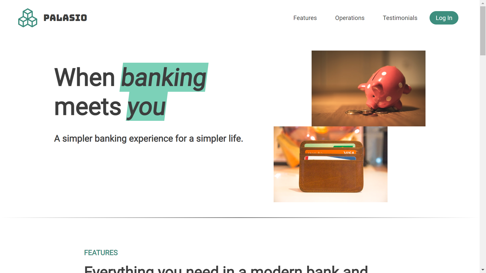
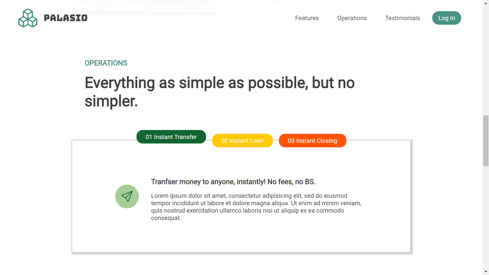
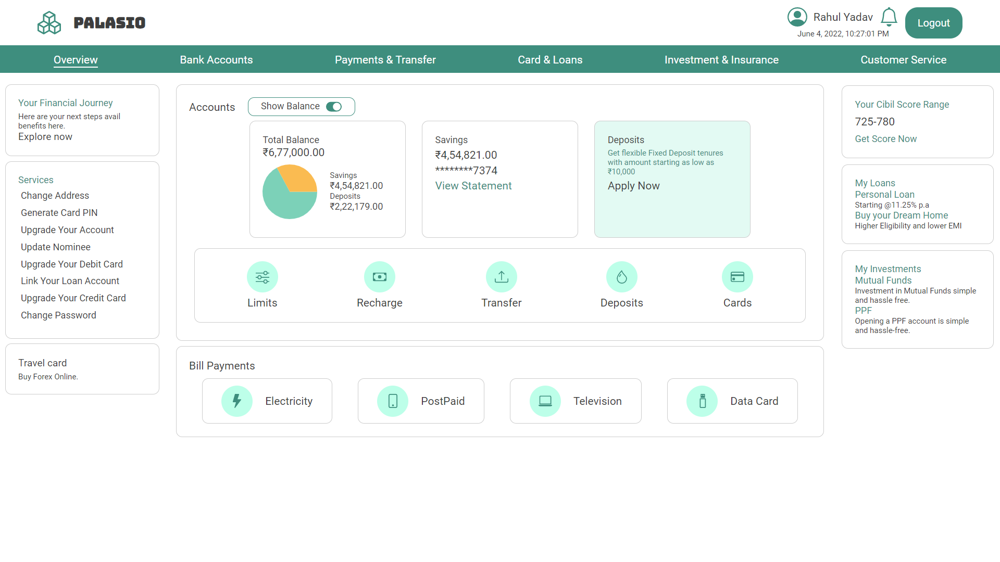
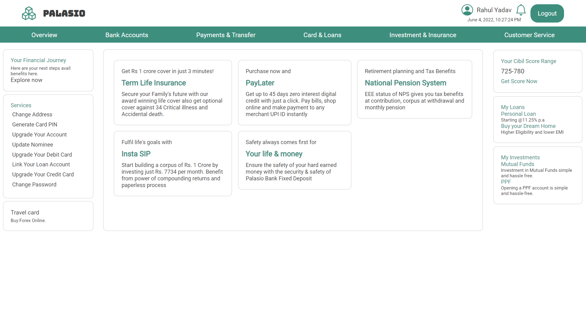
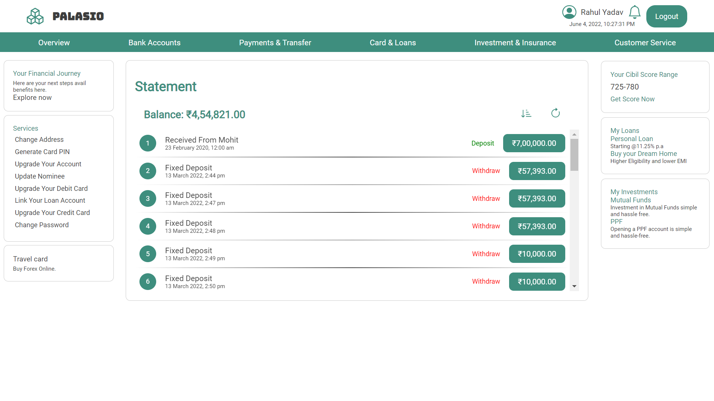
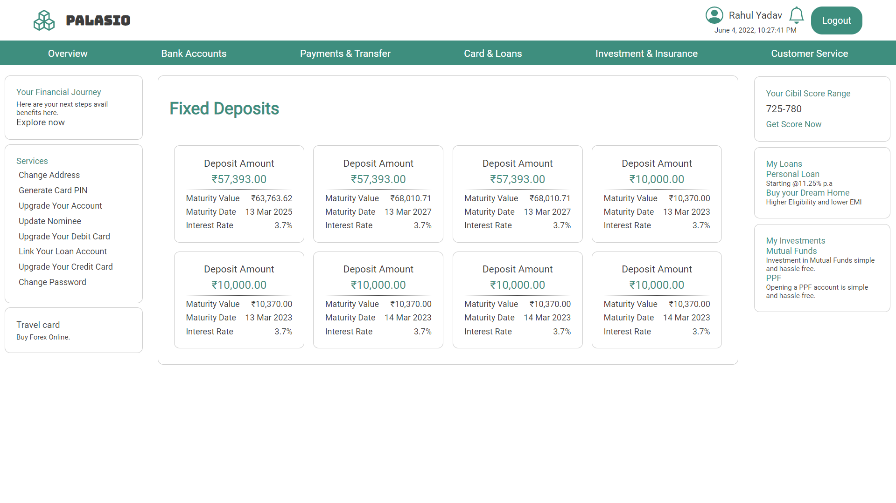

# Palasio Bank

A simpler banking experience for a simpler life.

---

## Tech Stack

**Client:** React, React Router

**Server:** Node, Express, MongoDB, Mongoose, Nodemailer

**Authentication:** JWT, Password Encryption with Bcrypt

## Functionalities

- Account summary
- Dashboard
- Change address
- Generate debit/credit card PIN
- Upgrade account
- Upgrade debit/credit card
- Update nominee
- Link loan account
- Change password
- Enquiry form
- Change debit/credit card limits
- Bill payment (Electricity/Data Card/Postpaid/Television)
- IMPS/NEFT/RTGS money transfer
- Create fixed deposits
- Account statement

## Screenshots

## 🌐 Demo

Have a look at the live demo of [Palasio Bank](https://palasio-bank.netlify.app/).

## 🚀 About Me

I'm a full stack developer (MERN). I have always been fascinated by technologies and how they have made our lives better. So learning and exploring new things have always made me happier.

## 🔗 Links

---